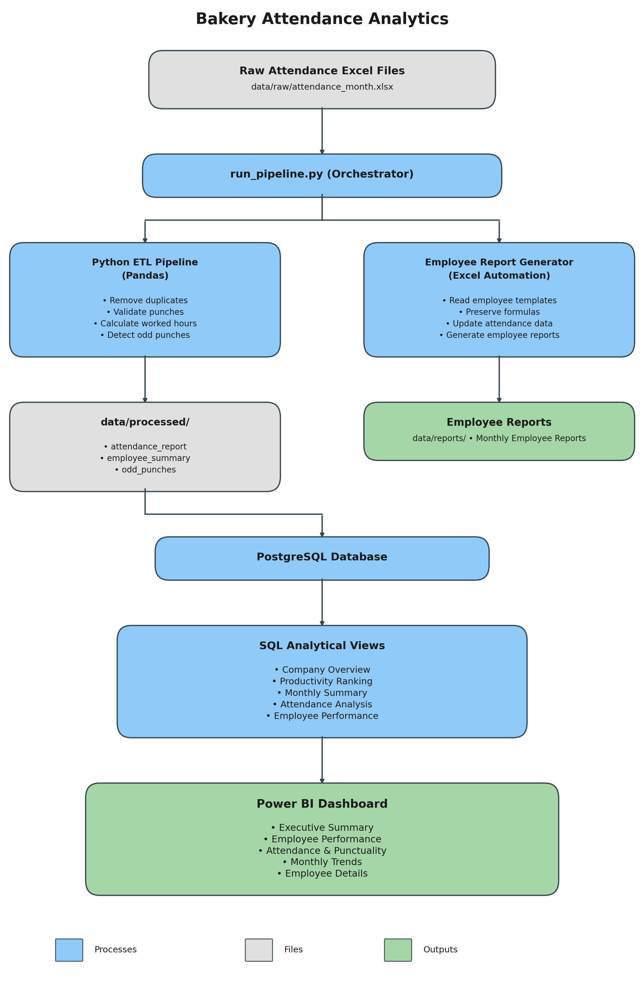
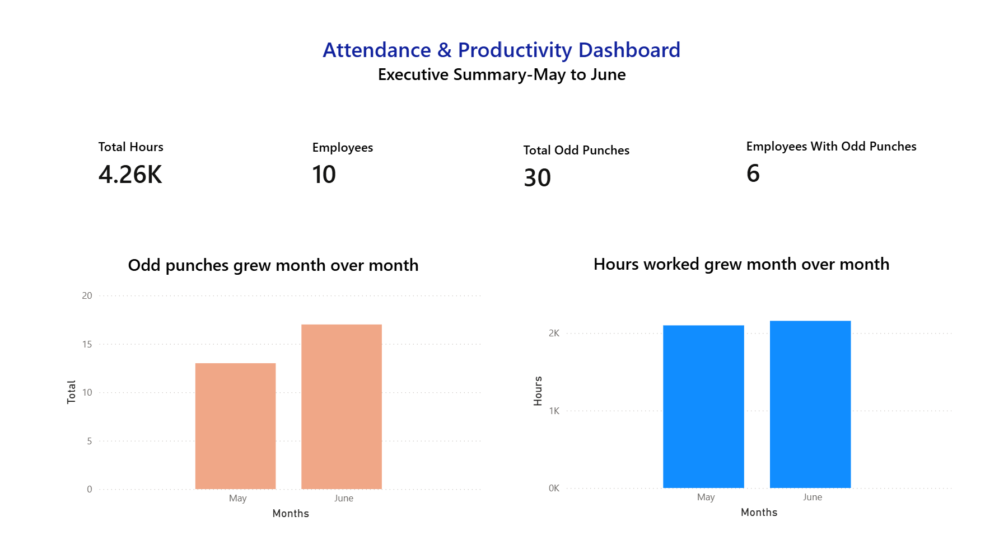
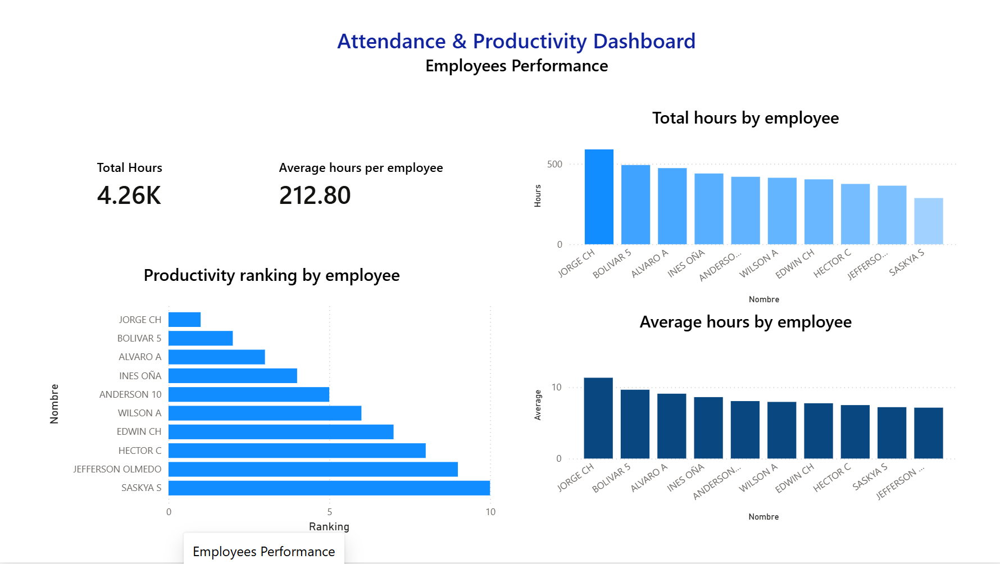
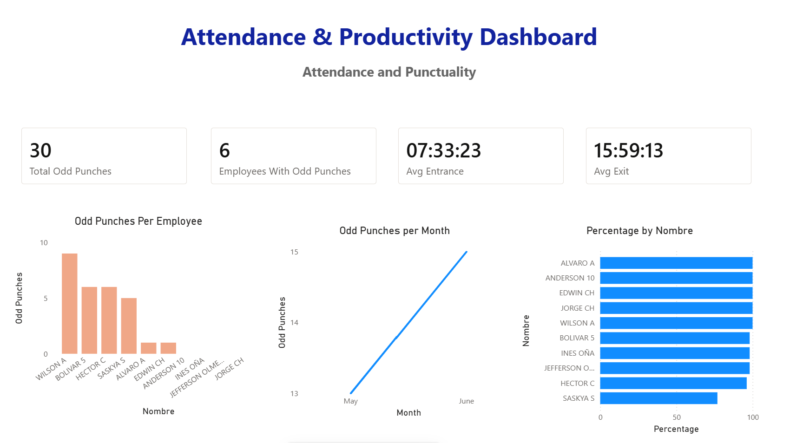
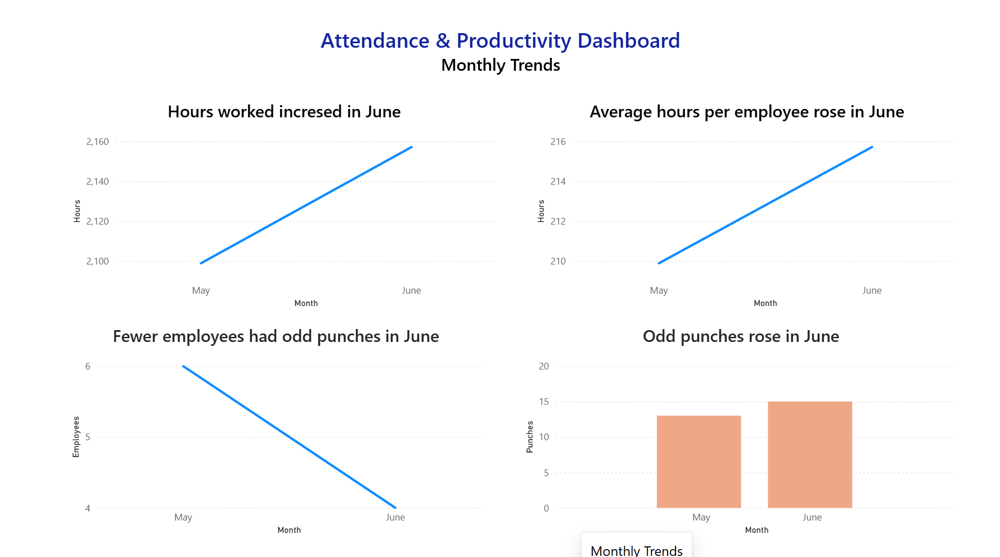
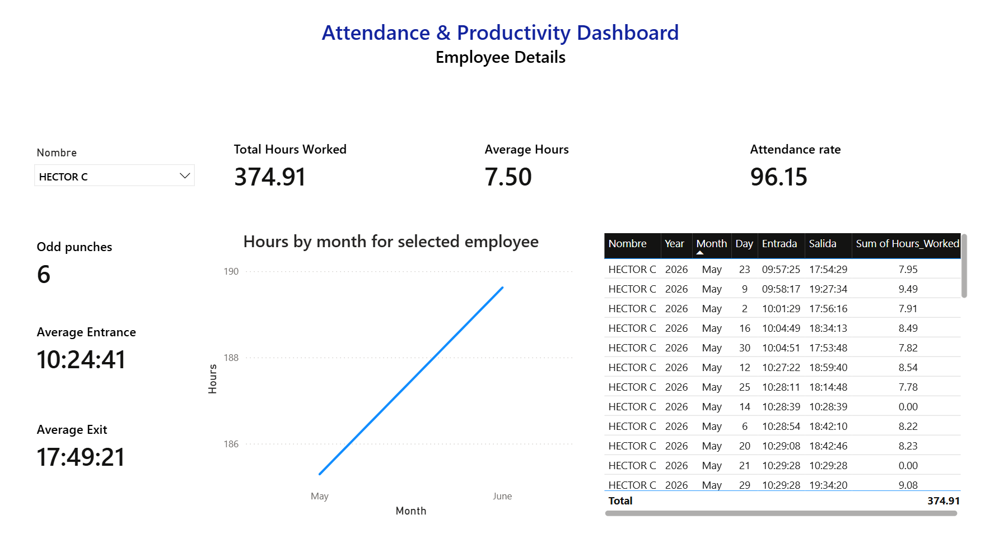

# 📊 Bakery Attendance Analytics Dashboard


## 🎯 Who this is for

An end-to-end data pipeline and BI project built to solve a real operational problem for a working bakery business — not a tutorial dataset. It demonstrates the full path from messy raw data to a decision-ready dashboard: **Python ETL → PostgreSQL → SQL analytics → Power BI**.

---

## 🏗 Solution Architecture



---

## 📖 Overview

The bakery tracked employee attendance using a biometric time clock that exported raw punch data to Excel. Every month, a manager had to manually clean that file, calculate hours by hand, and rebuild individual employee reports — slow, error-prone, and impossible to analyze at scale.

This project replaces that manual process with an automated pipeline that cleans the data, calculates worked hours, flags anomalies, loads everything into PostgreSQL, and powers a 5-page interactive Power BI dashboard — while also auto-generating each employee's individual attendance report from a protected Excel template, preserving its existing formulas and formatting.

---

## 📸 Dashboard Preview



---

## 🧩 Business Problem

Attendance was tracked via a biometric time clock, but the raw export created real, recurring problems:

* Duplicate punches from repeated clicks
* Missing exit or entry times (employees forgetting to clock out)
* No automated way to calculate worked hours
* Manual, time-consuming monthly reporting
* No visibility into attendance trends or productivity patterns

Management needed an automated pipeline that could clean the data, calculate accurate hours, generate reliable per-employee reports, and surface insights — without hours of manual Excel work every month.

## 📏 Business Rules Applied

The cleaning logic enforces the following rules, defined with the business:

* Exact duplicate rows are removed
* A record with no employee name is invalid and excluded
* A missing check-out is flagged as an anomaly ("odd punch"), not silently dropped
* Worked hours = check-out time − check-in time
* Punches recorded within a short window of each other are treated as duplicate scans, not separate visits
* Unnecessary/irrelevant columns from the raw export are dropped before processing

---

## 🚀 Solution

* Import raw attendance files automatically
* Clean duplicate and invalid punches
* Validate records against the business rules above
* Calculate entrance, exit, and total worked hours per employee per day
* Detect attendance anomalies (odd/missing punches)
* Load clean, structured data into PostgreSQL
* Expose analytics through reusable SQL views
* Auto-update individual employee Excel templates, preserving formulas
* Power interactive Power BI dashboards from the same SQL layer

---

## ⭐ Key Features

* Automated ETL pipeline using Python and Pandas
* Duplicate and anomaly detection (missing clock-outs)
* Automatic worked-hours calculation
* Automated, formula-preserving Excel report generation per employee
* PostgreSQL analytical reporting layer, decoupled from the dashboard
* SQL views with window functions (ranking, running totals, month-over-month comparisons)
* 5-page interactive Power BI dashboard, audience-structured (executive → individual employee)
* Environment-variable-based credential handling (no secrets in source control)

---

## 🛠 Technology Stack

| Technology | Purpose |
|---|---|
| Python | ETL orchestration and data cleaning |
| Pandas | Data transformation |
| PostgreSQL | Relational database |
| SQL | Analytics layer (views, window functions, CTEs) |
| Power BI | Dashboard and visualization |
| python-dotenv | Secure credential management |
| Git / GitHub | Version control, portfolio |

---

## ⚙ Pipeline Workflow

1. Raw attendance files are placed in `data/raw/`
2. `run_pipeline.py`, at the project root, orchestrates the full run
3. Python cleans and validates records against the business rules
4. Three processed datasets are generated: `attendance_report`, `employee_summary`, `odd_punches`
5. `export_to_sql.py` loads clean data into PostgreSQL (run separately once credentials are configured)
6. SQL views provide the reporting layer consumed by Power BI
7. Employee Excel templates are automatically updated, preserving formulas
8. Power BI reads directly from the PostgreSQL views to build all 5 dashboard pages

### Project Folder Structure

```text
bakery-attendance-analytics/
├── run_pipeline.py          # Orchestrator — entry point, run from project root
├── scripts/
│   ├── __init__.py
│   ├── final.py                     # Cleans raw data, calculates hours, detects anomalies
│   ├── export_to_sql.py             # Loads processed data into PostgreSQL
│   └── generate_employee_report.py  # Fills individual employee Excel templates
├── data/
│   ├── raw/          # Raw biometric export (not committed — see Data Privacy)
│   ├── processed/    # attendance_report.xlsx, employee_summary.xlsx, odd_punches.xlsx
│   ├── templates/    # Protected employee Excel templates
│   └── reports/      # Auto-generated individual employee reports
├── sql/
│   ├── views/                  # Reusable views powering Power BI
│   ├── business_questions/     # Ad-hoc analytical queries
│   └── window_functions/       # Ranking, running totals, trend analysis
├── dashboard/
│   ├── Bakery_Attendance.pbix
│   └── screenshots/
├── docs/
│   ├── business_process.md
│   └── businees_rules.md
├── requirements.txt
├── .env.example       # Template for local DB credentials — copy to .env
├── .gitignore
└── README.md
```

---

## 🗄 Database Layer

PostgreSQL stores the processed attendance data. Analytical SQL views sit between the raw tables and Power BI, so business logic lives in one reusable place instead of being duplicated across dashboard visuals.

## 📈 SQL Analytics

Business questions answered include:

* Which employees worked the most hours, and how did that change month over month?
* Which employees have the most (or fewest) odd punches, and how is that distributed?
* What's the company-wide running total of hours worked over time?
* How does each employee's workload compare to the company average?
* What percentage of employees are meeting an 8-hour average?

SQL techniques used: views, window functions (`RANK`, `DENSE_RANK`, `ROW_NUMBER`, `LAG`/`LEAD`, `NTILE`, `CUME_DIST`), running and moving averages, CTEs, and aggregate functions.

---

## 📊 Power BI Dashboard

Five pages, each built for a different audience:

| Page | Audience | Shows |
|---|---|---|
| Executive Summary | Leadership | Total hours, headcount, odd-punch KPIs at a glance |
| Employee Performance | Managers | Productivity ranking, total and average hours by employee |
| Attendance & Punctuality | HR / Ops | Attendance %, average entrance/exit, odd-punch breakdown |
| Monthly Trends | Leadership / Ops | Month-over-month trends across all core metrics |
| Employee Details | Individual review | Drill-down by employee with full attendance history |

---

## 📷 Dashboard Screenshots

| | |
|---|---|
|  |  |
|  |  |
|  | |

---

## 📈 Impact & Status

**In production use.** This isn't a demo — the bakery's accountant has used this pipeline for real monthly attendance reporting since [MONTH/YEAR]. It replaced a manual process that previously took approximately **30 per month** of manual Excel work; the automated pipeline now completes the same reporting in 30 seconds.

## 🧭 Lessons Learned

The pipeline was originally packaged as a standalone `.exe`/`.bat` file for easier handoff to a non-technical end user, but it failed to run on the accountant's machine — her computer runs a 32-bit architecture, while the executable was built on my 64-bit machine, and a 64-bit executable simply cannot run on 32-bit Windows. Rather than block delivery, I ran the pipeline locally each month and handed off the finished reports directly, prioritizing the business outcome over a blocked deployment. The proper fix is building the executable from a 32-bit Python environment (or targeting both architectures), which is on my list to implement.

## 💼 Business Value

* Eliminated hours of manual monthly attendance processing
* Increased reporting accuracy by removing manual calculation errors
* Automated, formula-preserving individual employee reports
* Surfaced attendance anomalies that were previously invisible in raw exports
* Gave management a self-service, interactive view into workforce trends

---

## 🚀 How to Run

1. Clone the repository
2. Install dependencies:
   ```bash
   pip install -r requirements.txt
   ```
3. Set up your local database credentials:
   ```bash
   cp .env.example .env
   # then edit .env with your real PostgreSQL credentials
   ```
4. Place the raw attendance Excel file inside `data/raw/`
5. Run the pipeline from the project root:
   ```bash
   python run_pipeline.py
   ```
6. Load the cleaned data into PostgreSQL:
   ```bash
   python scripts/export_to_sql.py
   ```
7. Open `dashboard/Bakery_Attendance.pbix` in Power BI Desktop and refresh

---

## 🔮 Future Improvements

* Scheduled ETL execution (Windows Task Scheduler or cron)
* Scheduled Power BI dataset refresh via Power BI Service
* Automated email notification on pipeline completion or anomaly spikes
* Unit tests covering the cleaning and hours-calculation logic

---

## 📄 Data Privacy

Raw attendance files and generated employee reports are excluded from this repository (see `.gitignore`) to protect employee privacy. Database credentials are never committed — see `.env.example`.

---

## 👨‍💻 Author

**Carlos Daniel Cueva**
Aspiring Data Analyst — SQL, Python, PostgreSQL, Power BI

---

## 📄 License

This repository is intended for educational and portfolio purposes.

